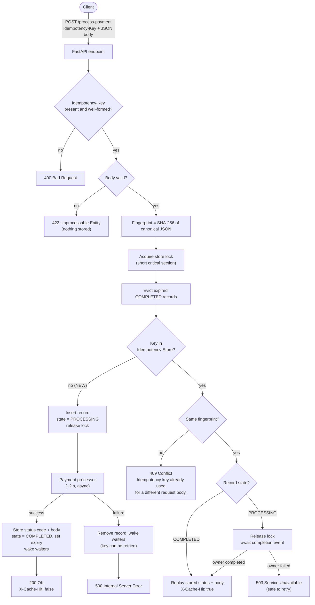
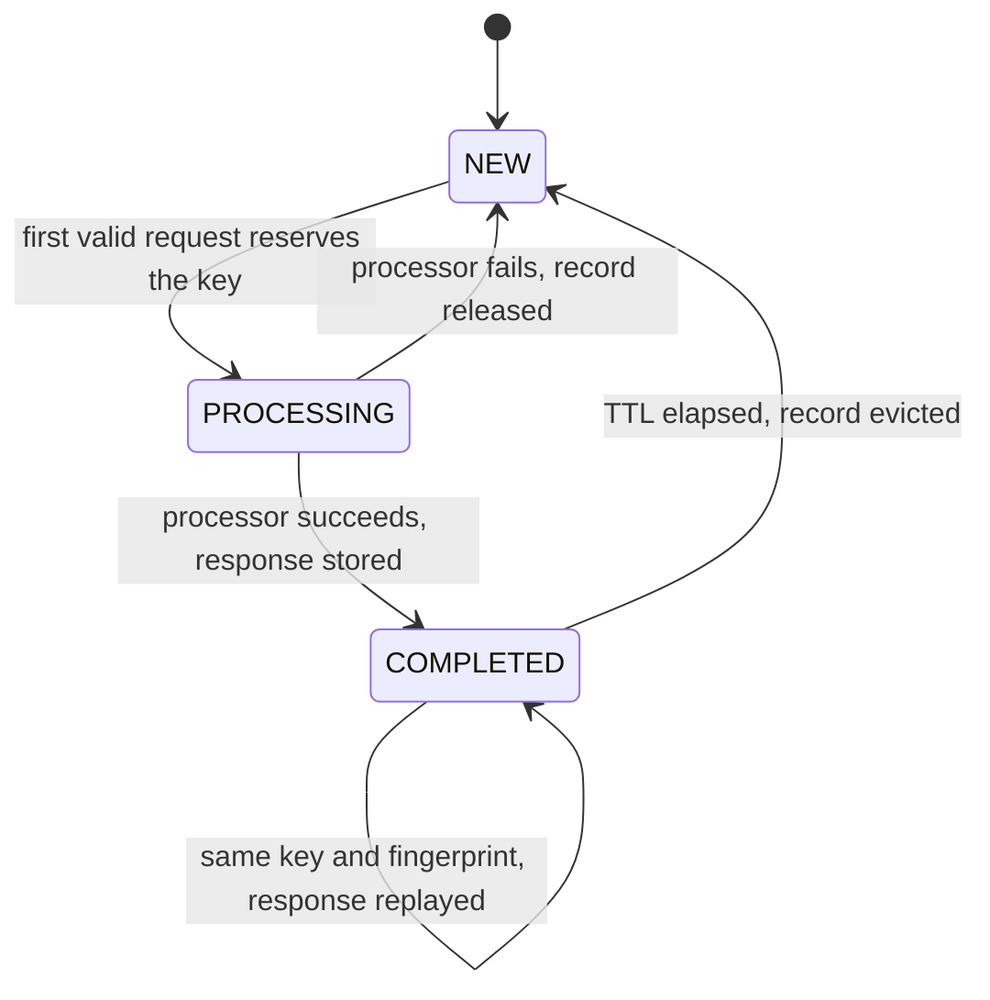
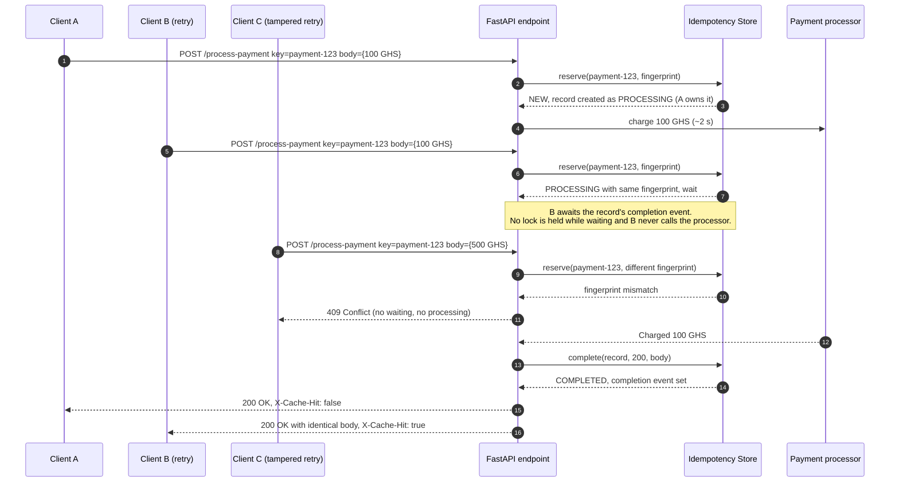

# Idempotency Gateway

A payment-processing API that guarantees a payment is charged **exactly once**, no matter how many times a client retries the same request. It is built with Python, FastAPI and asyncio.

## Contents

- [Overview](#overview)
- [Architecture](#architecture)
- [Request Lifecycle](#request-lifecycle)
- [Installation](#installation)
- [Running the API](#running-the-api)
- [API Documentation](#api-documentation)
- [Concurrent Request Behavior](#concurrent-request-behavior)
- [Design Decisions](#design-decisions)
- [Developer's Choice: Idempotency Record Expiry (TTL)](#developers-choice-idempotency-record-expiry-ttl)
- [Testing](#testing)
- [Production Considerations](#production-considerations)
- [Project Structure](#project-structure)

## Overview

Payment clients retry when a request times out. If the first attempt actually reached the server, a naive backend processes the retry as a brand-new payment and the customer is **charged twice**.

The gateway prevents this with the `Idempotency-Key` pattern. The client attaches a unique key to each logical payment and reuses it on every retry. The gateway remembers each key together with a fingerprint of the request body and the response it produced:

| Incoming request | Gateway behaviour |
|------------------|-------------------|
| New key | Processes the payment (~2 s) and stores the response |
| Same key and body, first attempt finished | Replays the stored response immediately with `X-Cache-Hit: true`. Nothing is charged. |
| Same key and body, first attempt still processing | Waits for the first attempt and replays its response. Nothing is charged. |
| Same key, different body | `409 Conflict`. Nothing is charged. |

## Architecture

### Components

| Component | Responsibility |
|-----------|----------------|
| **Client** | Sends `POST /process-payment` with an `Idempotency-Key` header and a JSON body. Retries with the same key when it does not hear back. |
| **FastAPI endpoint** (`app/api.py`) | Validates the header and body, computes the request fingerprint, delegates to the idempotency store and renders the (possibly replayed) response. No idempotency logic lives here. |
| **Request fingerprint** (`fingerprint_payload`) | SHA-256 of the canonical JSON form of the *validated* body: sorted keys, no insignificant whitespace, normalised amount. Logically identical bodies produce identical fingerprints. |
| **Idempotency store / registry** (`app/idempotency.py`) | In-memory map of `Idempotency-Key → record`. A record holds the fingerprint, the stored status code and body bytes once the payment completes, and an `asyncio.Event` that fires when processing finishes. An unset event means `PROCESSING`; a set event with a stored response means `COMPLETED`. |
| **PROCESSING record** | Reserves a key while its payment is being charged. It is inserted atomically before processing starts, so a concurrent duplicate always finds it. It never expires. |
| **Completion synchronisation** | Every state transition runs in a short critical section guarded by an `asyncio.Lock`. The lock is never held during processing. Duplicates that find a `PROCESSING` record await the record's `asyncio.Event`, which fires when the owner completes or fails. |
| **Payment processor** (`app/payments.py`) | Simulated charge: `asyncio.sleep(2)`, then returns a new transaction id. It runs at most once per key. |
| **Response replay** | The first response is serialised once to bytes and stored with its status code. The original request and every duplicate are served from those same bytes, so replays are byte-for-byte identical. |

### Request flow



### Record state machine

`NEW` is conceptual: it means that no record exists for the key.



Only `COMPLETED` records are subject to the TTL. A `PROCESSING` record never expires. When processing fails, requests already waiting on the record wake up and find no stored response (`FAILED`), and the record itself is removed.

### Concurrent retries



## Request Lifecycle

1. **First request.** The key is unknown. Under the lock, expired records are evicted and a `PROCESSING` record is inserted with the request fingerprint and a fresh completion event. Then the lock is released. The payment processor runs for about 2 seconds. Under the lock again, the status code and body bytes are stored, the record becomes `COMPLETED` and is queued for expiry, and the completion event fires. The client receives `200 OK` with `X-Cache-Hit: false`.
2. **Completed duplicate.** The key is known, the fingerprint matches and the record is `COMPLETED`. The stored status code and body bytes are returned immediately with `X-Cache-Hit: true`. The processor is not called and there is no delay (measured at about 6-25 ms locally, compared with about 2 s for the first request).
3. **In-flight duplicate.** The key is known, the fingerprint matches and the record is still `PROCESSING`. The request releases the lock and awaits the record's completion event. When the first request finishes, the duplicate returns the same stored response with `X-Cache-Hit: true`. If the first request fails or is cancelled instead, its record is removed, every waiter is woken and receives `503`, and the key is free to be retried.
4. **Same key, different body.** The key is known but the fingerprint differs. The gateway returns `409 Conflict` with `"Idempotency key already used for a different request body."` straight away, whether the original is `PROCESSING` or `COMPLETED`. Nothing is processed, nothing waits and the original record is untouched.

A request with a missing or malformed key, or an invalid body, is rejected **before** the store is touched, so it never creates or modifies a record.

## Installation

Requires **Python 3.11+** (developed and verified on Python 3.13).

**Windows (PowerShell)**

```powershell
git clone https://github.com/aijules/Idempotency-Gateway.git
cd Idempotency-Gateway
python -m venv .venv
.\.venv\Scripts\Activate.ps1
pip install -r requirements.txt
```

If script execution is disabled, skip activation and call the virtualenv's interpreter directly, for example `.\.venv\Scripts\python -m pip install -r requirements.txt`.

**macOS / Linux**

```bash
git clone https://github.com/aijules/Idempotency-Gateway.git
cd Idempotency-Gateway
python3 -m venv .venv
source .venv/bin/activate
pip install -r requirements.txt
```

`requirements.txt` holds the runtime dependencies only (FastAPI, Pydantic, Uvicorn). To run the tests, also install `requirements-dev.txt` (see [Testing](#testing)).

## Running the API

From the repository root, with the virtualenv active:

```bash
python -m uvicorn app.main:app --host 0.0.0.0 --port 8000
```

The server starts on `http://localhost:8000`. Opening that address in a browser redirects to the interactive Swagger UI at `/docs`. The OpenAPI schema is at `/openapi.json`.

> Run a **single worker process**. The idempotency store lives in process memory, so `--workers N` would give each worker its own store (see [Production Considerations](#production-considerations)).

### Configuration

All settings are optional environment variables. Invalid values stop the server at startup with a clear error.

| Variable | Default | Meaning |
|----------|---------|---------|
| `IDEMPOTENCY_TTL_SECONDS` | `86400` (24 h) | How long a completed response is retained and replayed, measured from completion. Must be > 0. |
| `PAYMENT_PROCESSING_DELAY_SECONDS` | `2` | Duration of the simulated payment processing. Must be ≥ 0. |

```powershell
# PowerShell
$env:IDEMPOTENCY_TTL_SECONDS = "3600"
python -m uvicorn app.main:app --host 0.0.0.0 --port 8000
```

```bash
# macOS / Linux
IDEMPOTENCY_TTL_SECONDS=3600 python -m uvicorn app.main:app --host 0.0.0.0 --port 8000
```

## API Documentation

### Endpoints

| Method | Path | Description |
|--------|------|-------------|
| `POST` | `/process-payment` | Charge a payment exactly once per `Idempotency-Key` |
| `GET` | `/docs` | Swagger UI |
| `GET` | `/openapi.json` | OpenAPI 3.1 schema |
| `GET` | `/` | Redirects to `/docs` |

### `POST /process-payment`

#### Headers

| Header | Required | Rules |
|--------|----------|-------|
| `Idempotency-Key` | Yes | 1-255 visible ASCII characters (no spaces or control characters), case-sensitive. Use a new value (e.g. a UUID) per logical payment and **reuse it on retries**. |
| `Content-Type` | Yes | `application/json` |

#### Request body

```json
{
  "amount": 100,
  "currency": "GHS"
}
```

| Field | Type | Rules |
|-------|------|-------|
| `amount` | JSON number | Greater than 0, at most 2 decimal places, at most 12 digits. Strings and booleans are rejected. |
| `currency` | string | Exactly three uppercase letters (ISO 4217 style), e.g. `GHS`, `USD`, `EUR` |

Unknown fields are rejected. Key order, whitespace and equivalent numbers (`100`, `100.0`, `100.00`) do not change the request's identity.

#### Success: `200 OK`

```http
HTTP/1.1 200 OK
content-type: application/json
x-cache-hit: false

{"transaction_id":"txn_0b85b62b776e4ca6a5b18f955f4ae18e","status":"Charged 100 GHS"}
```

#### Replayed duplicate: `200 OK` with `X-Cache-Hit: true`

Same status code and byte-identical body (note the unchanged `transaction_id`), returned without the processing delay:

```http
HTTP/1.1 200 OK
content-type: application/json
x-cache-hit: true

{"transaction_id":"txn_0b85b62b776e4ca6a5b18f955f4ae18e","status":"Charged 100 GHS"}
```

The server (Starlette/Uvicorn) sends header names in lowercase. HTTP header names are case-insensitive, so this is the `X-Cache-Hit` header.

#### Errors

| Status | When | Body |
|--------|------|------|
| `400 Bad Request` | `Idempotency-Key` missing or blank | `{"detail":"Missing required Idempotency-Key header."}` |
| `400 Bad Request` | `Idempotency-Key` too long or contains invalid characters | `{"detail":"Idempotency-Key must be 1-255 visible ASCII characters without whitespace."}` |
| `409 Conflict` | Key already used with a different body | `{"detail":"Idempotency key already used for a different request body."}` |
| `422 Unprocessable Entity` | Malformed JSON or invalid body | FastAPI validation errors (see below) |
| `503 Service Unavailable` | This request waited on an identical in-flight request that failed | `{"detail":"The in-flight request with this Idempotency-Key failed before completing. It is safe to retry with the same key."}` |
| `500 Internal Server Error` | The processor raised an unexpected error for the request that owned the key. The key is released. | `Internal Server Error` (plain text) |

Example `422` for `{"amount": -3, "currency": "ghs"}`:

```json
{
  "detail": [
    {"type": "greater_than", "loc": ["body", "amount"], "msg": "Input should be greater than 0", "input": -3, "ctx": {"gt": 0}},
    {"type": "string_pattern_mismatch", "loc": ["body", "currency"], "msg": "String should match pattern '^[A-Z]{3}$'", "input": "ghs", "ctx": {"pattern": "^[A-Z]{3}$"}}
  ]
}
```

### Examples

**curl** (macOS, Linux, Git Bash):

```bash
# 1. First request: takes ~2 s, X-Cache-Hit: false
curl -i -X POST http://localhost:8000/process-payment \
  -H "Content-Type: application/json" \
  -H "Idempotency-Key: order-1001" \
  -d '{"amount": 100, "currency": "GHS"}'

# 2. Retry: instant, identical body, X-Cache-Hit: true
curl -i -X POST http://localhost:8000/process-payment \
  -H "Content-Type: application/json" \
  -H "Idempotency-Key: order-1001" \
  -d '{"amount": 100, "currency": "GHS"}'

# 3. Same key, different amount: 409 Conflict
curl -i -X POST http://localhost:8000/process-payment \
  -H "Content-Type: application/json" \
  -H "Idempotency-Key: order-1001" \
  -d '{"amount": 500, "currency": "GHS"}'

# 4. Missing key: 400 Bad Request
curl -i -X POST http://localhost:8000/process-payment \
  -H "Content-Type: application/json" \
  -d '{"amount": 100, "currency": "GHS"}'

# 5. In-flight race: the second request waits for the first and gets the same transaction_id
curl -s -X POST http://localhost:8000/process-payment -H "Content-Type: application/json" \
  -H "Idempotency-Key: order-2002" -d '{"amount": 50, "currency": "USD"}' & \
sleep 0.5; \
curl -s -i -X POST http://localhost:8000/process-payment -H "Content-Type: application/json" \
  -H "Idempotency-Key: order-2002" -d '{"amount": 50, "currency": "USD"}'; wait
```

**Windows PowerShell:**

```powershell
$headers = @{ "Idempotency-Key" = "order-1001" }
$body = '{"amount": 100, "currency": "GHS"}'

$first = Invoke-WebRequest -UseBasicParsing -Method Post -Uri http://localhost:8000/process-payment `
  -Headers $headers -ContentType "application/json" -Body $body
$retry = Invoke-WebRequest -UseBasicParsing -Method Post -Uri http://localhost:8000/process-payment `
  -Headers $headers -ContentType "application/json" -Body $body

"$($first.StatusCode) X-Cache-Hit=$($first.Headers['X-Cache-Hit']) $($first.Content)"
"$($retry.StatusCode) X-Cache-Hit=$($retry.Headers['X-Cache-Hit']) $($retry.Content)"
```

## Concurrent Request Behavior

The bonus scenario is two identical requests racing: request B arrives while request A is still inside its ~2 second processing window. The gateway guarantees that the processor runs **once** and B receives A's result.

How race conditions are prevented:

1. **Atomic check-and-reserve.** Looking up the key and inserting the `PROCESSING` record happen in one critical section guarded by the store's `asyncio.Lock`, with no `await` inside. Whichever request enters first becomes the owner. Every later request sees the existing record, so two requests can never both become the owner.
2. **No lock during processing.** The owner releases the lock *before* calling the processor. Payments for other keys, replays and conflict checks are never blocked by a slow charge. A test proves that an unrelated key completes while another payment is held in flight.
3. **Waiting instead of rejecting.** A duplicate with the same fingerprint that finds a `PROCESSING` record releases the lock and awaits that record's `asyncio.Event`. It never calls the processor and is not rejected with `409`.
4. **Atomic completion and wake-up.** The owner stores the response, marks the record `COMPLETED` and sets the event inside one critical section. Waiters then read the response from the very record they were waiting on. Because they hold a reference to that record, an expiry or a later reuse of the key cannot hand them a different transaction's result.
5. **No stuck waiters.** If processing raises, *including task cancellation*, the owner removes the record (with an identity check, so it can only ever remove its own record) and sets the event without storing a response. Waiters wake immediately with `503`, and the key can be retried.
6. **Conflicts don't wait.** A different body with the same key returns `409` immediately, even while the original is still processing.

Verified against the running server with the default 2 s delay:

- A started, B (same body) was sent 0.5 s later and C (different body) 1 s later.
- C got `409` in 2.5 ms. A finished in 2.02 s. B finished together with A with a byte-identical body and `X-Cache-Hit: true`.
- Ten simultaneous identical requests all returned the same `transaction_id`, with one `X-Cache-Hit: false` and nine `true`. In a second run of ten, all ten completed within 2.15 s in total (not 20 s).

## Design Decisions

| Decision | Rationale |
|----------|-----------|
| **FastAPI + Uvicorn** | Native `async` request handling, which the in-flight wait needs (thousands of waiting requests cost only coroutines, not threads). It also brings Pydantic validation and generated OpenAPI docs with minimal code. |
| **Async processing** (`asyncio.sleep`) | The simulated 2 s charge yields the event loop, so other payments, replays and conflict checks are served while it runs. `time.sleep` would freeze the whole server. |
| **Canonical request fingerprint** | The body is validated first, then serialised as JSON with sorted keys and fixed separators, and the amount is normalised (`100`, `100.0` and `100.00` are the same payment). Clients that reorder keys or reformat JSON on retry are still recognised as retries. Raw dictionaries are never compared ad hoc. |
| **SHA-256** | A deterministic, collision-resistant digest of fixed size (64 hex chars), independent of payload size. Python's built-in `hash()` is unsuitable: it is salted per process for strings and not collision-resistant. |
| **`asyncio.Lock` + per-record `asyncio.Event`** | The lock makes the check-and-reserve, completion, failure and expiry transitions explicitly atomic, and would stay correct if the store gained an `await` (e.g. a Redis call). The event lets any number of duplicates wait for exactly one completion without polling or holding the lock. |
| **Cached response representation** | The response is stored as `(status_code, body bytes)` and always served as `application/json`. The first response is served from the same bytes as the replays, so a replay is byte-for-byte identical by construction rather than re-serialised. |
| **`200 OK` for success** | `/process-payment` is an action-style endpoint that returns the outcome of the charge. It does not create a separately addressable resource with a `Location`, which is what `201 Created` implies. Replays return the same `200` because the requirement is an identical response. |
| **`409 Conflict` for key reuse** | The body is valid, but it conflicts with the state already bound to the key. `422` stays reserved for invalid bodies, so each status code has exactly one meaning for clients. |
| **`400` for a bad key** | A missing or malformed header is a client error independent of the body. The header is validated before the body fields, so a request with both problems reports the key first. Only a body that is not parseable JSON is rejected earlier, by the framework, with `422`. |
| **Key sanity limits** | 1-255 visible ASCII characters (the same limit Stripe uses). This bounds memory per record, rejects blank keys and keeps keys safe to log. |
| **Validate before storing** | Invalid requests never reach the store, so they cannot create records, burn a key or disturb a completed record. |
| **Failure releases the key; waiters get `503`** | Transient processing failures are not cached, so the client can retry with the same key. Waiters fail fast with a retryable status instead of each re-running a possibly broken processor in turn. |
| **App factory with injected processor** | `create_app(settings, processor)` lets tests use a controllable processor. Production uses the real simulated 2 s processor, and one test also runs that unmodified default configuration. |

## Developer's Choice: Idempotency Record Expiry (TTL)

**What it does.** Completed idempotency records are retained for a configurable window (`IDEMPOTENCY_TTL_SECONDS`, default **86400 seconds = 24 hours**), measured from the moment the payment completed. Within the window, retries are replayed. After it, the record is evicted and the key can be used again.

**Why a fintech service needs it.** An idempotency store that only ever grows is a slow memory leak: every payment ever made would keep a record forever, and the service would eventually degrade or crash, taking payments down with it. Retries also have a natural lifetime. Clients retry for seconds or minutes, not months, so remembering a key forever buys no safety. Payment providers publish a bounded idempotency window for this reason (Stripe, for example, keeps keys for at least 24 hours). A bounded, documented window makes memory usage predictable and gives integrators a clear contract. **The TTL should be set to match the company's retry and idempotency policy.**

**How it works.**

- When a payment completes, `(expires_at, record)` is appended to an expiry queue. The TTL is constant and the clock is monotonic (`time.monotonic`, unaffected by wall-clock changes), so completion order is also expiry order.
- At the start of every request, inside the same critical section as the key lookup, expired records are popped from the front of the queue and removed. Each eviction is O(1) amortised, and the store never scans all records.
- **`PROCESSING` records are never queued, so an in-flight payment can never expire.** The TTL starts at completion, so a slow payment still gets its full replay window.
- Eviction happens before the lookup, so a request never sees a stale record. Removal is identity-checked, and waiters hold a reference to their own record, so an eviction cannot corrupt an in-flight or newer request.
- Eviction is lazy. With no traffic, expired records stay in memory until the next request, which is acceptable because no traffic also means no growth.

Tests use an injected fake clock to verify replay just before expiry, reprocessing at expiry, key reuse with a new body after expiry, eviction of keys that are never requested again, that in-flight records never expire, and that the TTL is measured from completion. An API-level test checks a short configured TTL through HTTP, and config tests cover parsing of `IDEMPOTENCY_TTL_SECONDS`. Against a live server started with `IDEMPOTENCY_TTL_SECONDS=3`, a key was replayed within the window and accepted a new body as a fresh charge after it.

## Testing

Install the test dependencies (they include the runtime requirements), then run the suite from the repository root:

```bash
pip install -r requirements-dev.txt
pytest
```

`python -m pytest` works as well. The full suite of 75 tests runs in about 7 seconds. Tests use an injected processor with a short or manually controlled delay. One test deliberately runs the unmodified default configuration with the real 2-second processor.

| File | Covers |
|------|--------|
| `tests/test_payments.py` | End-to-end HTTP behaviour through the ASGI app: first charge, key validation (missing, blank, too long, invalid characters), body validation (amount, currency, unknown fields, malformed JSON), exact replay of body, status and `X-Cache-Hit`, replay without the delay, key-order and number-format canonicalisation, `409` with the exact message, concurrency, failure handling, TTL and OpenAPI docs |
| `tests/test_idempotency_store.py` | Store and fingerprint unit tests: SHA-256 canonical fingerprints, failure and cancellation, unrelated keys, and TTL with a fake clock |
| `tests/test_config.py` | Environment defaults, parsing and rejection of invalid values |

Key concurrency and idempotency tests:

- **`test_in_flight_duplicate_waits_and_receives_the_first_result`**: a gated processor holds request A in flight. The test asserts that duplicate B is *blocked*, then releases A. B gets the identical body with `X-Cache-Hit: true`, and the processor ran once.
- **`test_burst_of_identical_requests_is_processed_exactly_once`**: 25 simultaneous identical requests produce exactly one processor call.
- **`test_in_flight_request_with_different_body_conflicts_without_waiting`**: `409` returns while the original is still held in flight.
- **`test_owner_failure_wakes_waiters_and_releases_the_key`** and **`test_owner_cancellation_wakes_waiters_and_releases_the_key`**: no waiter hangs when processing raises or is cancelled, and the key becomes reusable.
- **`test_unrelated_keys_are_not_blocked_by_an_in_flight_operation`**: no global lock is held during processing.
- **`test_default_configuration_simulates_two_second_processing`**: with the real 2 s processor, an in-flight duplicate and a later replay share one charge. The concurrent pair takes about 2 s, not 4 s, and the replay is instant.

## Production Considerations

This implementation is built to meet the challenge's requirements and is deliberately simple. **It is not production-ready as a payment system.** In particular:

- **Process-local, in-memory store.** All records live in one Python process. **Restarting the server clears every record**, and a retry after a restart would be charged again. Running several Uvicorn workers or several instances behind a load balancer would give each its own store, so a retry that lands on a different process would be charged twice.
- **Use a durable, shared store with atomic operations.** A horizontally scaled payment service should keep idempotency records in shared storage:
  - **PostgreSQL**: a table with a unique constraint on `(merchant_id, idempotency_key)`. The key is reserved with `INSERT ... ON CONFLICT DO NOTHING` in the same transaction as the payment record, and the response is stored in the row.
  - **Redis**: the key is reserved atomically with `SET key value NX PX <ttl>` (or a Lua script) and the completed response is stored under the key with an expiry. Pub/sub or polling wakes waiters in other processes.
- **Crash recovery for `PROCESSING` records.** In a durable store, a process that crashes mid-payment leaves a `PROCESSING` record behind. Production systems give reservations a lease or heartbeat and reconcile the payment's real outcome with the PSP before releasing or completing the key.
- **Timeouts.** The simulated processor cannot hang. A real processor call needs a timeout, and waiters should wait with a deadline.
- **Key scoping and auth.** Keys should be scoped per authenticated merchant or API credential so different clients cannot collide or probe each other's keys. This service has no authentication.
- **Propagate idempotency downstream.** The key (or a derived one) should be passed to the payment provider so the downstream charge is idempotent too.
- **Business outcomes vs. failures.** A declined card is a *completed* result and should be stored and replayed. Only transient infrastructure failures should release the key, as this implementation does.
- **Bounded memory.** The TTL bounds record *age*, not *count*. Production deployments should also apply rate limiting and capacity alerts, and the TTL should match the company's retry and idempotency policy.
- **Observability.** Emit metrics and structured logs for charges, replays, conflicts and in-flight waits.

## Project Structure

```text
Idempotency-Gateway/
├── app/
│   ├── __init__.py
│   ├── api.py               # HTTP layer: validation, routing, status-code mapping
│   ├── config.py            # Settings from environment variables
│   ├── idempotency.py       # Fingerprinting and the idempotency store (locking, waiting, TTL)
│   ├── main.py              # App factory and the ASGI app (app.main:app)
│   ├── models.py            # Pydantic request/response schemas
│   └── payments.py          # Simulated payment processor
├── tests/
│   ├── __init__.py
│   ├── conftest.py          # Runs async tests on the asyncio backend
│   ├── fakes.py             # Recording and gated processor test doubles
│   ├── test_config.py
│   ├── test_idempotency_store.py
│   └── test_payments.py
├── .gitattributes
├── .gitignore
├── LICENSE
├── pytest.ini
├── README.md
├── requirements-dev.txt     # Test dependencies (includes requirements.txt)
└── requirements.txt         # Runtime dependencies
```
