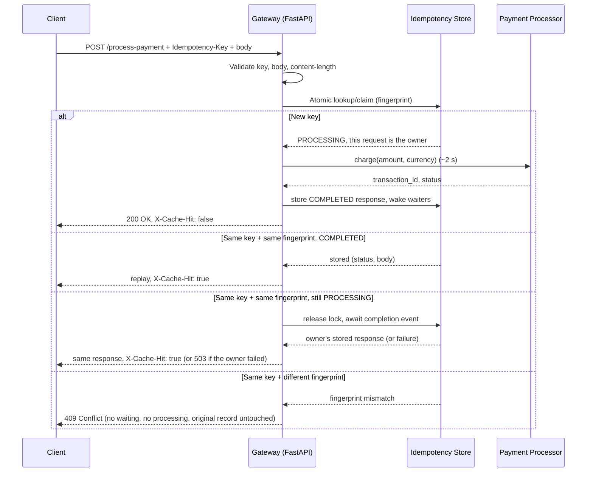
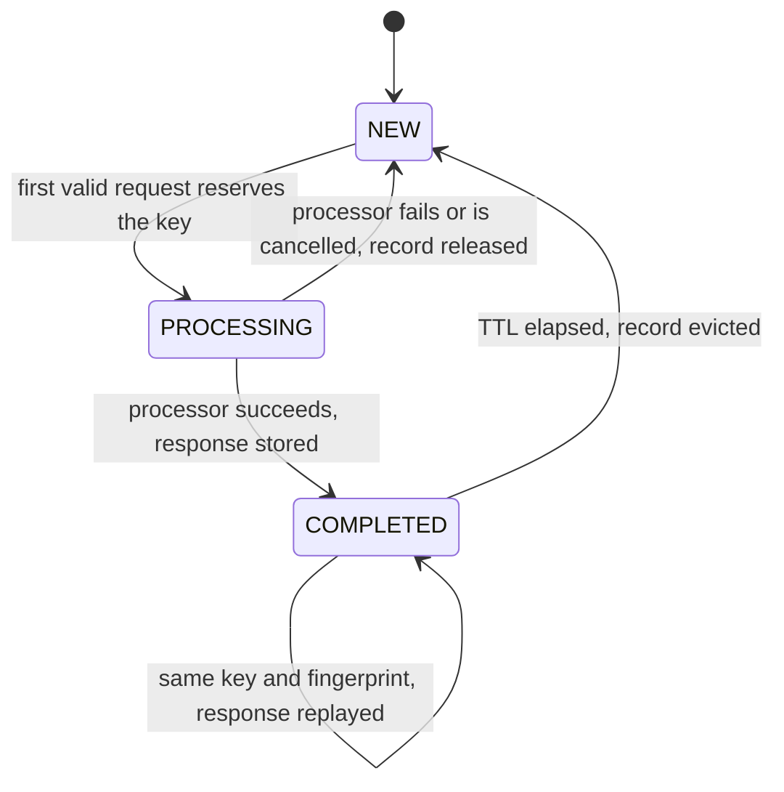

# Idempotency Gateway — Pay-Once Protocol

A payment-processing API that guarantees a payment is charged **at most once per idempotency key**, no matter how many times a client retries the same request. Built with Python, FastAPI and asyncio.

Live deployment: https://idempotency-gateway-production-dd6f.up.railway.app/docs

## Contents

- [Overview](#overview)
- [Architecture](#architecture)
- [Tech Stack](#tech-stack)
- [Project Structure](#project-structure)
- [Setup Instructions](#setup-instructions)
- [Environment Variables](#environment-variables)
- [API Documentation](#api-documentation)
- [Example curl Commands](#example-curl-commands)
- [Concurrency / Race Condition Design](#concurrency--race-condition-design)
- [Request Fingerprinting](#request-fingerprinting)
- [Idempotency Lifecycle](#idempotency-lifecycle)
- [Developer's Choice: Idempotency Record Expiry (TTL)](#developers-choice-idempotency-record-expiry-ttl)
- [Observability](#observability)
- [Running Tests](#running-tests)
- [Deployment](#deployment)
- [Production Considerations](#production-considerations)

## Overview

Payment clients retry when a request times out. If the first attempt actually reached the server, a naive backend processes the retry as a brand-new payment and the customer is **charged twice**.

The gateway prevents this with the `Idempotency-Key` pattern. The client attaches a unique key to each logical payment and reuses it on every retry. The gateway remembers each key together with a canonical fingerprint of the request body and the response it produced:

| Incoming request | Gateway behaviour |
|------------------|-------------------|
| New key | Processes the payment (~2 s) and stores the response |
| Same key and body, first attempt finished | Replays the stored response immediately with `X-Cache-Hit: true`. Nothing is charged again. |
| Same key and body, first attempt still processing | Waits for the first attempt and replays its response. Nothing is charged, the payment processor is never called a second time. |
| Same key, different body | `409 Conflict`. Nothing is charged, the original record is untouched. |

This describes the guarantee precisely: the gateway prevents duplicate processing for requests that share an idempotency key **within the guarantees of its configured idempotency store**. It does not claim distributed, cross-process exactly-once semantics — see [Production Considerations](#production-considerations) for exactly what that would require.

## Architecture

### Components

| Component | Responsibility |
|-----------|----------------|
| **Client** | Sends `POST /process-payment` with an `Idempotency-Key` header and a JSON body. Retries with the same key when it does not hear back. |
| **FastAPI endpoint** (`app/api.py`) | Validates the header and body, computes the request fingerprint, delegates to the idempotency store, logs the outcome and renders the (possibly replayed) response. No idempotency logic lives here. |
| **Request fingerprint** (`fingerprint_payload`) | SHA-256 of the canonical JSON form of the *validated* body: sorted keys, no insignificant whitespace, normalised amount. Logically identical bodies produce identical fingerprints. |
| **Idempotency store / registry** (`app/idempotency.py`) | In-memory map of `Idempotency-Key → record`. A record holds the fingerprint, the stored status code and body bytes once the payment completes, and an `asyncio.Event` that fires when processing finishes. An unset event means `PROCESSING`; a set event with a stored response means `COMPLETED`. |
| **PROCESSING record** | Reserves a key while its payment is being charged. It is inserted atomically before processing starts, so a concurrent duplicate always finds it. It never expires. |
| **Completion synchronisation** | Every state transition runs in a short critical section guarded by an `asyncio.Lock`. The lock is never held during processing. Duplicates that find a `PROCESSING` record await the record's `asyncio.Event`, which fires when the owner completes or fails. |
| **Payment processor** (`app/payments.py`) | Simulated charge: `await asyncio.sleep(delay)`, then returns a new transaction id. It runs at most once per key. |
| **Response replay** | The first response is serialised once to bytes and stored with its status code. The original request and every duplicate are served from those same bytes, so replays are byte-for-byte identical. |
| **Validation error sanitiser** (`app/api.py`) | Custom `RequestValidationError` handler that strips non-finite floats (`NaN`/`Infinity`) out of the echoed invalid input before JSON-encoding it, so a rejected value can never crash the error response itself. |
| **Unhandled-exception handler** (`app/api.py`) | Logs the failure server-side with full context and returns a generic `{"detail": "Internal Server Error"}` body — never a stack trace. |
| **Body-size middleware** (`app/middleware.py`) | Rejects requests whose `Content-Length` exceeds `MAX_REQUEST_BODY_BYTES` with `413`, before any parsing happens. |

### Request flow



### Record state machine

`NEW` is conceptual: it means that no record exists for the key.



Only `COMPLETED` records are subject to the TTL. A `PROCESSING` record never expires. When processing fails, requests already waiting on the record wake up to a `FAILED` outcome (`503`), and the record itself is removed so the key is immediately retryable.

## Tech Stack

| Technology | Role |
|---|---|
| **Python 3.11+** (developed and tested on 3.13) | Language |
| **FastAPI** | HTTP layer, request validation, OpenAPI/Swagger generation |
| **Pydantic v2** | Request/response schemas, `Decimal` amount validation and normalisation |
| **Uvicorn** | ASGI server |
| **asyncio** (`Lock`, `Event`) | Per-key single-flight concurrency control, no extra infrastructure |
| **pytest + pytest-anyio + httpx** | Async test suite driven directly against the ASGI app (no real network) |
| **Railway** | Hosting for the live deployment |

No database, cache or message broker is used. The idempotency store is a process-local, in-memory structure — see [Production Considerations](#production-considerations) for what that trades away and how it would be hardened.

## Project Structure

```text
Idempotency-Gateway/
├── app/
│   ├── __init__.py
│   ├── api.py               # HTTP layer: validation, routing, error handlers, /health
│   ├── config.py            # Settings from environment variables
│   ├── idempotency.py       # Fingerprinting and the idempotency store (locking, waiting, TTL)
│   ├── logging_config.py    # Logger setup (LOG_LEVEL)
│   ├── main.py               # App factory: wires store, processor, middleware, handlers
│   ├── middleware.py         # Request body-size guard
│   ├── models.py             # Pydantic request/response schemas
│   └── payments.py           # Simulated payment processor
├── tests/
│   ├── __init__.py
│   ├── conftest.py          # Runs async tests on the asyncio backend
│   ├── fakes.py             # Recording and gated processor test doubles
│   ├── test_config.py
│   ├── test_idempotency_store.py
│   └── test_payments.py
├── .gitattributes
├── .gitignore
├── LICENSE
├── Procfile                 # Deployment start command (Railway/Heroku-style)
├── pytest.ini
├── README.md
├── requirements-dev.txt     # Test dependencies (includes requirements.txt)
└── requirements.txt         # Runtime dependencies
```

## Setup Instructions

Requires **Python 3.11+** (developed and verified on Python 3.13).

**Windows (PowerShell)**

```powershell
git clone https://github.com/aijules/Idempotency-Gateway.git
cd Idempotency-Gateway
python -m venv .venv
.\.venv\Scripts\Activate.ps1
pip install -r requirements.txt
```

If script execution is disabled, skip activation and call the virtualenv's interpreter directly, for example `.\.venv\Scripts\python -m pip install -r requirements.txt`.

**macOS / Linux**

```bash
git clone https://github.com/aijules/Idempotency-Gateway.git
cd Idempotency-Gateway
python3 -m venv .venv
source .venv/bin/activate
pip install -r requirements.txt
```

`requirements.txt` holds the runtime dependencies only (FastAPI, Pydantic, Uvicorn). To run the tests, also install `requirements-dev.txt` (see [Running Tests](#running-tests)).

### Running the API locally

```bash
python -m uvicorn app.main:app --reload --host 0.0.0.0 --port 8000
```

The server starts on `http://localhost:8000`. Opening that address in a browser redirects to the interactive Swagger UI at `/docs`. The OpenAPI schema is at `/openapi.json`.

> Run a **single worker process**. The idempotency store lives in process memory, so `--workers N` would give each worker its own store (see [Production Considerations](#production-considerations)).

## Environment Variables

All settings are optional; sensible defaults apply. Invalid values stop the server at startup with a clear error rather than failing silently later.

| Variable | Default | Meaning |
|----------|---------|---------|
| `IDEMPOTENCY_TTL_SECONDS` | `86400` (24 h) | How long a completed response is retained and replayed, measured from completion. Must be > 0. |
| `PAYMENT_PROCESSING_DELAY_SECONDS` | `2` | Duration of the simulated payment processing. Must be ≥ 0. |
| `MAX_REQUEST_BODY_BYTES` | `16384` | Requests whose `Content-Length` exceeds this are rejected with `413` before parsing. Must be > 0. |
| `LOG_LEVEL` | `INFO` | One of `DEBUG`, `INFO`, `WARNING`, `ERROR`, `CRITICAL`. |

No secrets are required or stored by this service; `.env` files are git-ignored and none are committed.

```powershell
# PowerShell
$env:IDEMPOTENCY_TTL_SECONDS = "3600"
python -m uvicorn app.main:app --host 0.0.0.0 --port 8000
```

```bash
# macOS / Linux
IDEMPOTENCY_TTL_SECONDS=3600 python -m uvicorn app.main:app --host 0.0.0.0 --port 8000
```

## API Documentation

### Endpoints

| Method | Path | Description |
|--------|------|-------------|
| `POST` | `/process-payment` | Charge a payment at most once per `Idempotency-Key` |
| `GET` | `/health` | Liveness probe, always `200 {"status": "ok"}` while the process is up |
| `GET` | `/docs` | Swagger UI |
| `GET` | `/openapi.json` | OpenAPI 3.1 schema |
| `GET` | `/` | Redirects to `/docs` |

### `POST /process-payment`

#### Headers

| Header | Required | Rules |
|--------|----------|-------|
| `Idempotency-Key` | Yes | 1-255 visible ASCII characters (no spaces or control characters), case-sensitive. Use a new value (e.g. a UUID) per logical payment and **reuse it on retries**. |
| `Content-Type` | Yes | `application/json` |

#### Request body

```json
{
  "amount": 100,
  "currency": "GHS"
}
```

| Field | Type | Rules |
|-------|------|-------|
| `amount` | JSON number | Greater than 0, finite (NaN/Infinity rejected), at most 2 decimal places, at most 12 digits. Strings and booleans are rejected. |
| `currency` | string | Exactly three uppercase letters (ISO 4217 style), e.g. `GHS`, `USD`, `EUR` |

Unknown fields are rejected. Key order, whitespace and equivalent numbers (`100`, `100.0`, `100.00`) do not change the request's identity — see [Request Fingerprinting](#request-fingerprinting).

#### Success: `200 OK`

```http
HTTP/1.1 200 OK
content-type: application/json
x-cache-hit: false

{"transaction_id":"txn_0b85b62b776e4ca6a5b18f955f4ae18e","status":"Charged 100 GHS"}
```

#### Replayed duplicate: `200 OK` with `X-Cache-Hit: true`

Same status code and byte-identical body (note the unchanged `transaction_id`), returned without the processing delay — the stored response from the original transaction, never a freshly reconstructed one:

```http
HTTP/1.1 200 OK
content-type: application/json
x-cache-hit: true

{"transaction_id":"txn_0b85b62b776e4ca6a5b18f955f4ae18e","status":"Charged 100 GHS"}
```

The server (Starlette/Uvicorn) sends header names in lowercase. HTTP header names are case-insensitive, so this is the `X-Cache-Hit` header.

#### Errors

| Status | When | Body |
|--------|------|------|
| `400 Bad Request` | `Idempotency-Key` missing or blank | `{"detail":"Missing required Idempotency-Key header."}` |
| `400 Bad Request` | `Idempotency-Key` too long or contains invalid characters | `{"detail":"Idempotency-Key must be 1-255 visible ASCII characters without whitespace."}` |
| `409 Conflict` | Key already used with a different body | `{"detail":"Idempotency key already used for a different request body."}` |
| `413 Payload Too Large` | Request body exceeds `MAX_REQUEST_BODY_BYTES` | `{"detail":"Request body exceeds the 16384-byte limit."}` |
| `422 Unprocessable Content` | Malformed JSON or invalid body (including non-numeric, non-finite, zero or negative amounts) | FastAPI-style validation error list |
| `503 Service Unavailable` | This request waited on an identical in-flight request that failed | `{"detail":"The in-flight request with this Idempotency-Key failed before completing. It is safe to retry with the same key."}` |
| `500 Internal Server Error` | The processor raised an unexpected error for the request that owned the key. The key is released so a retry is safe. | `{"detail":"Internal Server Error"}` (no stack trace; logged server-side) |

Example `422` for `{"amount": -3, "currency": "ghs"}`:

```json
{
  "detail": [
    {"type": "greater_than", "loc": ["body", "amount"], "msg": "Input should be greater than 0", "input": -3, "ctx": {"gt": 0}},
    {"type": "string_pattern_mismatch", "loc": ["body", "currency"], "msg": "String should match pattern '^[A-Z]{3}$'", "input": "ghs", "ctx": {"pattern": "^[A-Z]{3}$"}}
  ]
}
```

## Example curl Commands

**curl** (macOS, Linux, Git Bash):

```bash
# 1. First request: takes ~2 s, X-Cache-Hit: false
curl -i -X POST http://localhost:8000/process-payment \
  -H "Content-Type: application/json" \
  -H "Idempotency-Key: order-1001" \
  -d '{"amount": 100, "currency": "GHS"}'

# 2. Duplicate: instant, identical body, X-Cache-Hit: true
curl -i -X POST http://localhost:8000/process-payment \
  -H "Content-Type: application/json" \
  -H "Idempotency-Key: order-1001" \
  -d '{"amount": 100, "currency": "GHS"}'

# 3. Same key, different amount: 409 Conflict
curl -i -X POST http://localhost:8000/process-payment \
  -H "Content-Type: application/json" \
  -H "Idempotency-Key: order-1001" \
  -d '{"amount": 500, "currency": "GHS"}'

# 4. Missing key: 400 Bad Request
curl -i -X POST http://localhost:8000/process-payment \
  -H "Content-Type: application/json" \
  -d '{"amount": 100, "currency": "GHS"}'

# 5. In-flight race: the second request waits for the first and gets the same transaction_id
curl -s -X POST http://localhost:8000/process-payment -H "Content-Type: application/json" \
  -H "Idempotency-Key: order-2002" -d '{"amount": 50, "currency": "USD"}' & \
sleep 0.5; \
curl -s -i -X POST http://localhost:8000/process-payment -H "Content-Type: application/json" \
  -H "Idempotency-Key: order-2002" -d '{"amount": 50, "currency": "USD"}'; wait

# 6. Health check
curl -i http://localhost:8000/health
```

**Windows PowerShell:**

```powershell
$headers = @{ "Idempotency-Key" = "order-1001" }
$body = '{"amount": 100, "currency": "GHS"}'

$first = Invoke-WebRequest -UseBasicParsing -Method Post -Uri http://localhost:8000/process-payment `
  -Headers $headers -ContentType "application/json" -Body $body
$retry = Invoke-WebRequest -UseBasicParsing -Method Post -Uri http://localhost:8000/process-payment `
  -Headers $headers -ContentType "application/json" -Body $body

"$($first.StatusCode) X-Cache-Hit=$($first.Headers['X-Cache-Hit']) $($first.Content)"
"$($retry.StatusCode) X-Cache-Hit=$($retry.Headers['X-Cache-Hit']) $($retry.Content)"
```

## Concurrency / Race Condition Design

Two requests with the same `Idempotency-Key` and body can arrive within microseconds of each other while the first is still being charged. The gateway guarantees the processor runs **once** and every caller receives the same result — this is the single most important property of the service.

How it works:

1. **Atomic check-and-reserve.** Looking up the key and inserting the `PROCESSING` record happen inside one critical section guarded by the store's `asyncio.Lock`, with no `await` inside it. Because Python's asyncio event loop is single-threaded and cooperative, a section with no `await` cannot be interleaved with another coroutine — whichever request's lookup-and-insert runs first becomes the owner, deterministically. A test (`test_concurrent_first_use_with_different_bodies_is_deterministic`) fires two requests for a brand-new key with two different bodies via `asyncio.gather` and asserts exactly one becomes the owner (charged once) and the other gets `409`.
2. **No lock held during processing.** The owner releases the lock *before* calling the payment processor. Payments for other keys, replays and conflict checks are never blocked by a slow charge (`test_unrelated_keys_are_not_blocked_by_an_in_flight_operation`).
3. **Waiting instead of rejecting.** A duplicate with the same fingerprint that finds a `PROCESSING` record releases the lock and awaits that record's `asyncio.Event`. It never calls the processor and is not rejected with `409` (`test_in_flight_duplicate_waits_and_receives_the_first_result`).
4. **Atomic completion and wake-up.** The owner stores the response, marks the record `COMPLETED` and sets the event inside one critical section. Waiters read the response from the very record they were waiting on, so an expiry or a later reuse of the key cannot hand them a different transaction's result.
5. **No stuck waiters on failure.** If processing raises — including task cancellation — the owner removes the record (identity-checked, so it can only ever remove its own record) and sets the event without storing a response. Waiters wake immediately with `503` and the key is free to retry (`test_owner_failure_wakes_waiters_and_releases_the_key`, `test_owner_cancellation_wakes_waiters_and_releases_the_key`).
6. **Conflicts never wait.** A different body with the same key returns `409` immediately, even while the original is still processing (`test_in_flight_request_with_different_body_conflicts_without_waiting`).

Verified against a burst of 25 simultaneous identical requests (`test_burst_of_identical_requests_is_processed_exactly_once`): the processor runs exactly once, and exactly one response carries `X-Cache-Hit: false` while the other 24 carry `X-Cache-Hit: true` with byte-identical bodies.

**Scope of the guarantee.** `asyncio.Lock` and `asyncio.Event` coordinate coroutines *within a single Python process*. This is correct and sufficient for the current deployment, which runs one Uvicorn worker and one Railway replica. It would **not** be sufficient across multiple processes or replicas — see [Production Considerations](#production-considerations).

## Request Fingerprinting

Two requests are the "same logical payment" if they carry the same `Idempotency-Key` **and** an equivalent body — not the same raw bytes. Comparing raw JSON strings would treat `{"amount":100,"currency":"GHS"}` and `{"currency": "GHS", "amount": 100}` as different requests, which is wrong.

The fingerprint is computed in two steps:

1. **Validate and normalise.** Pydantic parses the body first. `amount` becomes a `Decimal`, then `100`, `100.0` and `100.00` are all normalised to the same canonical `Decimal("100")` (see `PaymentRequest.normalise_amount` in `app/models.py`). Only a validated, normalised dict — never the raw request bytes — is fingerprinted.
2. **Canonicalise and hash.** The validated dict is serialised with `json.dumps(payload, sort_keys=True, separators=(",", ":"))` — sorted keys, no insignificant whitespace — and hashed with **SHA-256** (`fingerprint_payload` in `app/idempotency.py`).

This makes reordered keys, pretty-printing and equivalent numeric formats fingerprint identically, while a genuinely different amount or currency always fingerprints differently. SHA-256 is deterministic across restarts and processes, unlike Python's built-in `hash()`, which is randomly salted per interpreter run for strings and must never be used for this purpose.

## Idempotency Lifecycle

Each `Idempotency-Key` maps to at most one record, which moves through these states (see `IdempotencyRecord` in `app/idempotency.py`):

- **`PROCESSING`** — the key has been claimed, the payment is in flight. Represented as `record.finished` (an `asyncio.Event`) not yet set. Never expires.
- **`COMPLETED`** — `record.finished` is set and `record.response` holds the stored `(status_code, body)`. Replayed for the remainder of the TTL window, then evicted.
- **`FAILED`** — a transient, terminal state: `record.finished` is set but `record.response` is `None`. The record is removed from the store immediately when this happens; only requests that were already waiting on it ever observe it (as a `503`). A fresh request with the same key afterwards is treated as `NEW`.
- **`EXPIRED`** — conceptual, not a stored state: once the TTL elapses the record is evicted (lazily, at the start of the next request) and the key becomes available again as if it had never been used.

## Developer's Choice: Idempotency Record Expiry (TTL)

**What it does.** Completed idempotency records are retained for a configurable window (`IDEMPOTENCY_TTL_SECONDS`, default **86400 seconds = 24 hours**), measured from the moment the payment completed. Within the window, retries are replayed. After it, the record is evicted and the key can be used again.

**Why a fintech service needs it.** An idempotency store that only ever grows is a slow memory leak: every payment ever made would keep a record forever, and the service would eventually degrade or crash, taking payments down with it. Retries also have a natural lifetime — clients retry for seconds or minutes, not months, so remembering a key forever buys no safety. Payment providers publish a bounded idempotency window for this reason (Stripe, for example, keeps keys for at least 24 hours). A bounded, documented window makes memory usage predictable and gives integrators a clear contract. **The TTL should be set to match the company's retry and idempotency policy.**

**How it works.**

- When a payment completes, `(expires_at, record)` is appended to an expiry queue. The TTL is constant and the clock is monotonic (`time.monotonic`, unaffected by wall-clock changes), so completion order is also expiry order.
- At the start of every request, inside the same critical section as the key lookup, expired records are popped from the front of the queue and removed. Each eviction is O(1) amortised, and the store never scans all records.
- **`PROCESSING` records are never queued, so an in-flight payment can never expire.** The TTL starts at completion, so a slow payment still gets its full replay window.
- Eviction happens before the lookup, so a request never sees a stale record. Removal is identity-checked, and waiters hold a reference to their own record, so an eviction cannot corrupt an in-flight or newer request.
- Eviction is lazy: with no traffic, expired records stay in memory until the next request, which is acceptable because no traffic also means no growth.

**Configuration.** `IDEMPOTENCY_TTL_SECONDS` (see [Environment Variables](#environment-variables)).

**Limitations.** Eviction is lazy, so memory is not reclaimed the instant a record expires if there is no further traffic. There is no maximum record *count*, only a maximum record *age* — see [Production Considerations](#production-considerations) for how a durable store would add capacity limits.

Tests use an injected fake clock to verify replay just before expiry, reprocessing at expiry, key reuse with a new body after expiry, eviction of keys that are never requested again, that in-flight records never expire, and that the TTL is measured from completion. An API-level test checks a short configured TTL through HTTP, and config tests cover parsing of `IDEMPOTENCY_TTL_SECONDS`.

## Observability

- **Audit-style logging.** Every outcome of `POST /process-payment` (charged, replayed, conflict, in-flight failure) is logged at `INFO`/`WARNING` with the idempotency key and a 12-character fingerprint prefix — never the raw request body — so a payment's history can be traced without exposing full payloads in logs. Configurable via `LOG_LEVEL`.
- **Unhandled errors** are logged server-side with full context (`logger.error(..., exc_info=exc)`) but the client only ever receives `{"detail": "Internal Server Error"}` — no stack trace is exposed.
- **Liveness probe.** `GET /health` returns `200 {"status": "ok"}` unconditionally while the process is running, for use by Railway/uptime monitoring. It does not check the idempotency store or any dependency, because there currently are none to check.
- Not implemented: request/correlation IDs, metrics export, or a distributed tracing integration. The `Idempotency-Key` itself doubles as a natural correlation key across the log lines for a given payment.

## Running Tests

Install the test dependencies (they include the runtime requirements), then run the suite from the repository root:

```bash
pip install -r requirements-dev.txt
pytest -v
```

`python -m pytest` works as well. The full suite of 88 tests runs in about 5 seconds. Tests use an injected processor with a short or manually controlled delay; one test deliberately runs the unmodified default configuration with the real 2-second processor.

| File | Covers |
|------|--------|
| `tests/test_payments.py` | End-to-end HTTP behaviour through the ASGI app: first charge, key validation, body validation (including `NaN`/`Infinity`), oversized bodies, exact replay of body/status/`X-Cache-Hit`, key-order and number-format canonicalisation, `409` conflicts (including a true concurrent race for a brand-new key), concurrency, failure handling (with a clean JSON `500` body), TTL and OpenAPI/health endpoints |
| `tests/test_idempotency_store.py` | Store and fingerprint unit tests: SHA-256 canonical fingerprints, failure and cancellation, unrelated keys, and TTL with a fake clock |
| `tests/test_config.py` | Environment defaults, parsing and rejection of invalid values for every setting |

Key concurrency and idempotency tests:

- **`test_burst_of_identical_requests_is_processed_exactly_once`**: 25 simultaneous identical requests produce exactly one processor call, all sharing one response.
- **`test_concurrent_first_use_with_different_bodies_is_deterministic`**: two requests race to claim a *brand-new* key with different bodies; exactly one is charged, the other gets `409`, deterministically.
- **`test_in_flight_duplicate_waits_and_receives_the_first_result`**: a gated processor holds request A in flight; duplicate B is provably blocked, then receives A's exact result once released.
- **`test_in_flight_request_with_different_body_conflicts_without_waiting`**: `409` returns immediately while the original is still held in flight.
- **`test_owner_failure_wakes_waiters_and_releases_the_key`** / **`test_owner_cancellation_wakes_waiters_and_releases_the_key`**: no waiter hangs when processing raises or is cancelled, and the key becomes reusable.
- **`test_unrelated_keys_are_not_blocked_by_an_in_flight_operation`**: no global lock is held during processing.
- **`test_non_finite_amount_is_cleanly_rejected`**: `NaN`/`Infinity`/`-Infinity` amounts fail with a clean `422`, not a `500`.
- **`test_default_configuration_simulates_two_second_processing`**: with the real 2 s processor, an in-flight duplicate and a later replay share one charge.

## Deployment

The service is deployed on [Railway](https://railway.com), built directly from this GitHub repository (`aijules/Idempotency-Gateway`, `main` branch) using Railway's Railpack builder.

- **Start command:** defined in [`Procfile`](Procfile) — `web: uvicorn app.main:app --host 0.0.0.0 --port $PORT`. Railpack's automatic FastAPI detection looks for a root-level `main.py`/`app.py`; because this project's entry point is the `app` package (`app/main.py`), the `Procfile` makes the start command explicit and reproducible instead of relying on a dashboard-only setting.
- **Networking:** a public Railway domain is generated for the service, forwarding to the port Uvicorn binds via `$PORT`.
- **Replicas:** exactly **one**. See [Production Considerations](#production-considerations) for why this currently matters.
- **Configuration:** all tunables are environment variables (see [Environment Variables](#environment-variables)); none are required, so the service runs with sane defaults out of the box.

To redeploy manually with the Railway CLI:

```bash
npm install -g @railway/cli
railway login
railway link   # select the existing project/service
railway up
```

## Production Considerations

This implementation is built to meet the challenge's requirements and is deliberately simple. **It is not a production-ready payment system as-is.** Concretely, and stated honestly rather than aspirationally:

- **Process-local, in-memory store.** All idempotency records live in one Python process's memory. **Restarting the server clears every record**, and a retry after a restart would be charged again. Running several Uvicorn workers or several Railway replicas would give each its own store, so a retry that lands on a different process would be charged twice. The current deployment deliberately runs a single replica to avoid this.
- **What a durable, shared store would look like:**
  - **PostgreSQL:** a table with a unique constraint on `(merchant_id, idempotency_key)`. The key is reserved with `INSERT ... ON CONFLICT DO NOTHING` in the same transaction as the payment record, and the response is stored in the row. This gives atomic claim-or-detect-conflict semantics across any number of processes.
  - **Redis:** the key is reserved atomically with `SET key value NX PX <ttl>` (or a Lua script for claim+conflict-check in one round trip), and the completed response is stored under the key with an expiry. Pub/sub or short polling would be needed to wake waiters running in a *different* process, since `asyncio.Event` only works within one process.
  - Either option replaces this repository's `IdempotencyStore` behind the same `run_once(key, fingerprint, operation)` interface it already exposes, so the HTTP layer would not need to change.
- **Crash recovery for `PROCESSING` records.** In a durable store, a process that crashes mid-payment leaves a `PROCESSING` record behind with no owner left to complete or release it. Production systems give reservations a lease/heartbeat and reconcile the payment's real outcome with the PSP before releasing or completing the key. This gateway's in-memory `PROCESSING` state is implicitly released by a process crash (everything in memory is gone), which is safe only because there is nothing durable to reconcile against.
- **Timeouts.** The simulated processor cannot hang. A real processor call needs a timeout, and waiters should wait with a deadline instead of indefinitely.
- **Key scoping and auth.** There is no authentication. Keys should be scoped per authenticated merchant/API credential so different clients cannot collide or probe each other's keys.
- **Propagate idempotency downstream.** The key (or a derived one) should be passed to the real payment provider so the downstream charge is idempotent too, not just the call to this gateway.
- **Business outcomes vs. transient failures.** A declined card is a *completed* result and should be stored and replayed like a success. Only transient infrastructure failures should release the key, as this implementation does.
- **Bounded memory, not bounded traffic.** The TTL bounds record *age*, not *count* or arrival *rate*. Production deployments should add capacity alerts and rate limiting; neither is implemented here.
- **CORS.** No CORS middleware is configured, so browsers cannot call this API cross-origin at all — the safe default for a backend payment API with no browser-facing frontend. If a frontend is added, it should get an explicit origin allow-list, never `*`.
- **Observability.** Basic audit logging exists (see [Observability](#observability)); there is no metrics export, tracing, or alerting integration.
- **Horizontal scaling.** Not supported today (see the first bullet). Enabling it requires the durable-store change above; nothing else in the request-handling logic would need to change, because the concurrency contract is already expressed as a single `run_once` operation.
